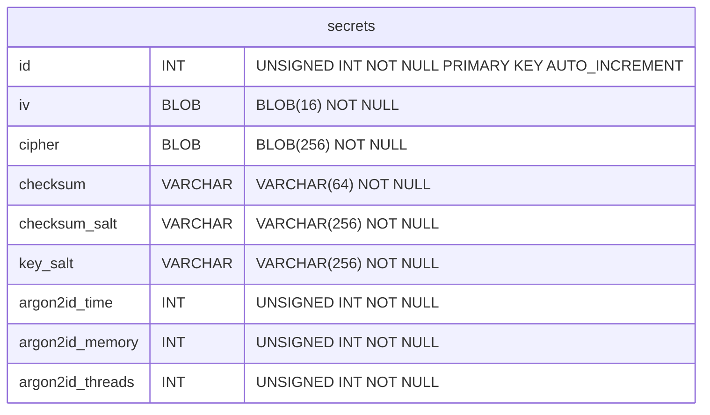

# Self-hosted secret manager

Antonio Jose Donis Hung - antoniojosedonishung@gmail.com

## Abstract

The primary purpose of a password manager is to act as a digital memory aid, storing complex passwords that are otherwise challenging for most people to remember. Recognizing the necessity of password management, this document aims to address secondary concerns: What if I lose my phone? How can I access backups in emergencies? Are my passwords inter-operable across different platforms and programs? Most critically, can I trust an online password manager with my sensitive data? This document outlines a system, not just a software, enabling anyone, regardless of their programming knowledge, to securely store passwords and other secrets on their own devices.

## Problem statement

The modern internet user faces a significant issue: lack of digital sovereignty. Most rely on third-party companies for managing their online identities and assets. For instance, Google, a popular service for email setup, becomes a single point of failure; losing access to one's Google account can cascade into losing access to various services linked to that email. Similarly, when considering file backups, the go-to solutions are Google Drive, OneDrive, and iCloud – all controlled by major corporations. How can we be certain they can't access our files? This uncertainty extends to online password managers, which might pose risks, especially for activists in hostile environments.

Key concerns include:

- The potential for online password managers to be compromised, posing risks to privacy and security.
- The need for decentralized, zero-trust methods for file backups.
- Ensuring that password storage is end-to-end encrypted, with encryption starting the moment data is input.

## Philosophy

Inspired by the UNIX philosophy, zero trust principles, and decentralized foundations, this system adheres to the following constraints:

- All secrets are encrypted before being written to disk.
- Memory is randomized just after being used.
- The system avoids custom binary formats; it uses an SQLite database, facilitating compatibility and transition between different tools. This approach addresses the common issue of proprietary, non-free formats prevalent in many mobile apps, which are challenging to reverse-engineer.
- Backup processes are founded on zero-trust principles, ensuring that no reliance is placed on the service provider for privacy or data longevity.

## Encryption

The system should be secured by mathematically proved cryptography, no obscurity, this way even if the attacker has the cipher text, the cipher text checksum, the IV or the stretched password length. It should be also impossible to him for cracking our credentials. 

The overall storage of secret will be made using an **SQLite** database with this unique table.



Based on the previous table each field is:

- `id`: This field is reserved for application specific in case a re-implementation of the systems wants to associate certain metadata to a secret. For example: the website of which the password is related to.

- `iv`: AES IV, is a 16 bytes securely random generated string. This field should be obtained from a securely random source.

- `cipher`: The stored encrypted secret. A 256 sized blob with the encrypted secret.

- `checksum*`: `argon2id | sha3_512` backed checksum of the `cipher` field, this will prevent the engine from retrieving invalid results.

- `argon2id*`: `argon2id` setup settings

Now, with this known table, process of encryption goes as follows:

```
#### Inputs
Master password           # User defined master password
Secret                    # User defined secret

Salt                      # Defined in configuration
Time                      # Defined in configuration
Memory                    # Defined in configuration
Threads                   # Defined in configuration
Checksum salt             # Defined in configuration
Stretched password length # Hardcoded to 32
Stretched buffer length   # Hardcoded to 256

#### Algorithm
Stretched password        : Argon2id(
                                Master password, 
                                Stretched password length,
                                Salt,
                                Time,
                                Memory,
                                Threads
                            )
Buffer                    : alloc(256)
Buffer[0]                 : len(Secret)
Buffer[1:len(secret)]     : Secret
Buffer[len(secret):]      : Random data
IV                        : Random data
Cipher                    : aes.Encrypt(
                                Buffer,
                                IV,
                                Stretched password,
                                mode.CBC
                            )
Stretched buffer          : Argon2id(
                                Buffer, 
                                Stretched buffer length,
                                Checksum salt,
                                Time,
                                Memory,
                                Threads
                            )
Checksum                   : SHA3_512(Stretched buffer)
```

And the decryption process goes as follows:

```
#### Inputs
Master password           # User defined master password
Cipher                    # User selected cipher

IV                        # Obtained from the row of the cipher
Salt                      # Obtained from the row of the cipher
Time                      # Obtained from the row of the cipher
Memory                    # Obtained from the row of the cipher
Threads                   # Obtained from the row of the cipher
Checksum                  # Obtained from the row of the cipher
Checksum salt             # Obtained from the row of the cipher
Stretched password length # Hardcoded to 32
Stretched buffer length   # Hardcoded to 256

#### Algorithm
Stretched password        : Argon2id(
                                Master password, 
                                Stretched password length,
                                Salt,
                                Time,
                                Memory,
                                Threads
                            )
Buffer                    : aes.Decrypt(
                                Cipher,
                                IV,
                                Stretched password,
                                mode.CBC
                            )
Secret length             : Buffer[0]
Secret                    : Buffer[1:Secret length + 1]
Stretched buffer          : Argon2id(
                                Buffer, 
                                Stretched buffer length,
                                Checksum salt,
                                Time,
                                Memory,
                                Threads
                            )
Checksum                  : SHA3_512(Stretched buffer)
# Here the user confirms the computed checksum matches the original one
```

### Ideas of attacks and their prevention

This section addresses potential security concerns to demonstrate the robustness of the cryptographic approach in the system.

#### Master Password Protection

To safeguard against the unauthorized extraction of the master password, which could lead to the decryption of all stored passwords, the system employs key stretching through `argon2id`. This approach generates a distinct password for each stored secret, diverging from the master password. Each secret's encryption password is computed individually, compelling an attacker to break into each one separately. If an attacker targets the master password, they will face a significantly more complex time challenge, since they will to generate a arbitrary length password ofwhich then compute the `argon2id`. This increased security level is contingent upon the `argon2id` parameters being set to create a computationally demanding function. To maximize security, applications using this system are **advised to configure these parameters optimally**, tailored to the specific hardware capabilities of each platform.

#### Oracle padding attack

Oracle padding attack consist in a malicious actor studying how the encryption and decryption algorithm behave against invalid input. This attack focus on the padding calculation part, of which the attacker expects the cryptographic algorithm to crash or respond with an `Invalid padding` error. This will let the attacker exfiltrate the message size, which then will allow him to easy the process of breaking the final cipher.

`guardian` prevents this by using a fixed block size of **256** bytes long of which the first byte correspond to a `uint8` value (minimum value is **0**, max value is **255**) describing the length of the actual encrypted message. Forcing a always valid padding, since the `nil` secrets are valid and the max value for a secret is **255** the defined length byte will never overlay the actual buffer length. 

#### Other ways to guess the message size

An attacker could perform a message size guessing by reading until a non printable character is reached. In the example bellow the user encrypted the secret **KEY** of which the vanilla random padding generated a buffer of which the first byte is a non printable character `\n`. Allowing the attacker perform targeted detection in case the secret was not randomly generated. Like in this example, by having the secret be a valid english word.

```
+------------+--------+--------+--------+-------------+
| Msg lengtg | Byte 1 | Byte 2 | Byte 3 | Padding ... |
+------------+--------+--------+--------+-------------+
|     3      |    K   |   E    |    Y   |   0x0A      |
+------------+--------+--------+--------+-------------+
```

This can be prevented by adding filtering from the secure random source, only the english language characters and symbols. Mainly, only the printable ASCII characters. This may result in a smaller set of options per byte. But will make impossible for the adversary on guessing the actual size of the message. Combined with the **Oracle Padding Attack** prevention, the attacker will be always forced to compute the checksum on the decrypted message to confirm its validity, resulting in more time complexity for him.

## File sharing

```
TODO: This section is still in design
```
