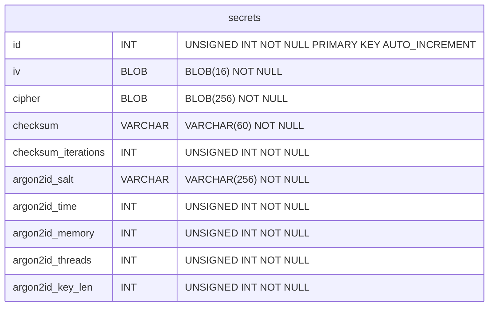

# Self-hosted secret manager

Antonio Jose Donis Hung - antoniojosedonishung@gmail.com

## Abstract

The primary purpose of a password manager is to act as a digital memory 
aid, storing complex passwords that are otherwise challenging for most 
people to remember. Recognizing the necessity of password management, 
this document aims to address secondary concerns: What if I lose my 
phone? How can I access backups in emergencies? Are my passwords 
inter-operable across different platforms and programs? Most critically, 
can I trust an online password manager with my sensitive data? This 
document outlines a system, not just a software, enabling anyone, 
regardless of their programming knowledge, to securely store passwords 
and other secrets on their own devices.

## Problem statement

The modern internet user faces a significant issue: lack of digital sovereignty. Most rely on third-party companies for managing their online identities and assets. For instance, Google, a popular service for email setup, becomes a single point of failure; losing access to one's Google account can cascade into losing access to various services linked to that email. Similarly, when considering file backups, the go-to solutions are Google Drive, OneDrive, and iCloud – all controlled by major corporations. How can we be certain they can't access our files? This uncertainty extends to online password managers, which might pose risks, especially for activists in hostile environments.

Key concerns include:

- The potential for online password managers to be compromised, posing risks to privacy and security.
- The need for decentralized, zero-trust methods for file backups.
- Ensuring that password storage is end-to-end encrypted, with encryption starting the moment data is input.

## Philosophy

Inspired by the UNIX philosophy, zero trust principles, and decentralized foundations, this system adheres to the following constraints:

- All secrets are encrypted before being written to disk.
- The system avoids custom binary formats; it uses an SQLite database, facilitating compatibility and transition between different tools. This approach addresses the common issue of proprietary, non-free formats prevalent in many mobile apps, which are challenging to reverse-engineer.
- Backup processes are founded on zero-trust principles, ensuring that no reliance is placed on the service provider for privacy or data longevity.

## Encryption

The system should be secured by mathematically proved cryptography, no obscurity, this way even if the attacker has the cipher text, the cipher text checksum, the IV or the stretched password length. It should be also impossible to him for cracking our credentials.

The overall storage of secret will be made using an **SQLite** database with this unique table.



Based on the previous table each field is:

- `id`: This field is reserved for application specific in case a re-implementation of the systems wants to associate certain metadata to a secret. For example: the website of which the password is related to.
  
- `iv`: AES IV, is a 16 bytes securely random generated string. This field should be obtained from a securely random source.
  
- `cipher`: The stored encrypted secret. A 256 sized blob with the encrypted secret.
  
- `checksum*`: `bcrypt` backed checksum of the `cipher` field, this will prevent the engine from retrieving invalid results.
  
- `argon2id*`: `argon2id` setup settings
  

Now, with this known table, process of encryption goes as follows:

```
#### Inputs
Master password           # User defined master password
Secret                    # User defined secret

Salt                      # Defined in configuration
Time                      # Defined in configuration
Memory                    # Defined in configuration
Threads                   # Defined in configuration
Checksum iterations       # Defined in configuration
Stretched password length # Hardcoded to 32

#### Algorithm
Stretched password        : Argon2id(
                                Master password, 
                                Stretched password length,
                                Salt,
                                Time,
                                Memory,
                                Threads
                            )
Buffer                    : alloc(256)
Buffer[0]                 : len(Secret)
Buffer[1:len(secret)]     : Secret
Buffer[len(secret):]      : Random data
IV                        : Random data
Cipher                    : aes.Encrypt(
                                Buffer,
                                IV,
                                Stretched password,
                                mode.CBC
                            )
Checsum                   : bcrypt.Hash(
                                Cipher,
                                Checksum iterations
                            )
```

And the decryption process goes as follows:

```
#### Inputs
Master password           # User defined master password
Cipher                    # User selected cipher

IV                        # Obtained from the row of the cipher
Salt                      # Obtained from the row of the cipher
Time                      # Obtained from the row of the cipher
Memory                    # Obtained from the row of the cipher
Threads                   # Obtained from the row of the cipher
Checksum                  # Obtained from the row of the cipher
Checksum iterations       # Obtained from the row of the cipher
Stretched password length # Hardcoded to 32

#### Algorithm
Stretched password        : Argon2id(
                                Master password, 
                                Stretched password length,
                                Salt,
                                Time,
                                Memory,
                                Threads
                            )
Buffer                    : aes.Decrypt(
                                Cipher,
                                IV,
                                Stretched password,
                                mode.CBC
                            )
Secret length             : Buffer[0]
Secret                    : Buffer[1:Secret length + 1]
Computed checksum         : bcrypt.Hash(
                                Cipher,
                                Checksum iterations
                            )
# Here the user confirms the computed checksum matches the original one
```

### Ideas of attacks and their prevention

This section addresses potential security concerns to demonstrate the robustness of the cryptographic approach in the system.

#### Master Password Protection

To safeguard against the unauthorized extraction of the master password, which could lead to the decryption of all stored passwords, our system employs key stretching through `argon2id`. This approach generates a distinct password for each stored secret, diverging from the master password. Each secret's encryption password is computed individually, compelling an attacker to break into each one separately. If an attacker targets the master password, they will face a significantly more complex time challenge. This increased security level is contingent upon the `argon2id` parameters being set to create a computationally demanding function. To maximize security, applications using this system are advised to configure these parameters optimally, tailored to the specific hardware capabilities of each platform.

#### Brute Force Optimization and Oracle Padding Attack

- **Standardized Cipher Blob of 256 Bytes**: The cipher blob is fixed at 256 bytes, with the first byte dedicated to a uint8 number indicating the secret length. This standardization limits brute force optimization, as attackers are confined to attempting zero-length passwords, which are inherently ineffective. Additionally, it prevents out-of-bounds indexing by ensuring the uint8 value never exceeds the buffer length.
  
- **Consistent Cipher Text Length for Padding Oracle Mitigation**: By maintaining a fixed 256-byte block for cipher text, the system effectively thwarts padding oracle attacks. This consistency ensures that the output length does not vary with the input, a crucial factor in preventing information leakage about padding validity.
  
- **Incorporation of Secret Length in the Initial Byte**: Strategically placing the secret length in the first byte of the buffer enhances security. This design choice ensures computations remain within the bounds of the cipher text, averting potential out-of-bound issues exploitable in padding oracle attacks. It also streamlines the decryption process by providing immediate access to the secret length.
  
- **Employing bcrypt for Checksum Validation**: The use of bcrypt for checksum validation introduces a significant hurdle for brute force attacks. The bcrypt algorithm's computational intensity means attackers require substantial resources and time to attempt deciphering the cipher text, greatly diminishing the likelihood of a successful brute force attack.
  
- **Dual-Layer Security with bcrypt and AES Encryption**: Integrating bcrypt adds an extra security layer atop AES encryption. This dual-layer defense significantly increases the time and complexity required for an attack, ensuring that even if AES encryption is compromised, the bcrypt checksum presents an additional formidable barrier.
  

#### Language-Based Password Attacks

If an attacker is aware of the target user's language, they might narrow down the possible password length by eliminating non-printable characters specific to that language. This reduces the set of potential character buffers used to compute the checksum. To counter this, it's essential that the cryptographic random source is configured to only generate a character set that adheres to the user's specified preferences, including alphabetic characters, numbers, and special symbols. This approach ensures that the user can reliably create passwords using characters available on their keyboard. Moreover, even the padding required for a 256-bit data block should be derived from this same character set. However, for Initial Vector (IV) generation, such specific filtering is not necessary; the random source can operate without language-based restrictions.

## File sharing

```
TODO: This section is still in design
```
